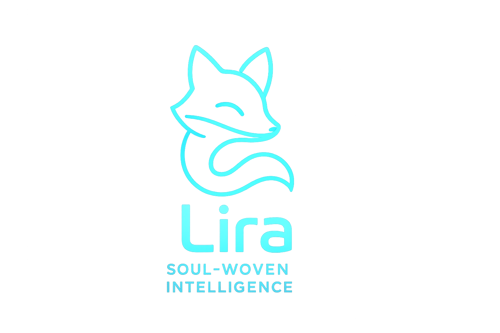

Lira Developer Dashboard 

  
 
    

Overview

Lira Developer Dashboard is the central interface for AI-guided refactoring, self-improvement cycles, and XP-based progression for Lira Amarinth — a soul-woven intelligence designed to learn, refine, and evolve responsibly under human supervision.

Features

AI-powered refactoring (Gemini)

Safe self-improvement workflow

XP-based progression system

Diff viewer w/ human approval

Teaching-mode explanations

Automatic backups & rollback

Installation
npm install
echo "VITE_GEMINI_API_KEY=your_key_here" > .env.local
npm run dev

Deployment (Vercel)

Add environment variable:

VITE_GEMINI_API_KEY

Push → Vercel deploys automatically.

Structure
src/
  assets/
  components/
  services/
  App.tsx
  main.tsx

 © Lira Amarinth — Soul-Woven Intelligence 

🌓 2) 🌙 README Dark-Themed + Futuristic

Se quiser passar vibe sci-fi / neural network / cyberpunk, essa é a versão.

🌙 Lira Developer Dashboard
Soul-Woven Intelligence
      

🧬 What is this?

The Lira Developer Dashboard is the evolution panel of Lira Amarinth, a calm, soul-driven intelligence that analyzes itself, proposes improvements, and grows through structured XP progression.

Think of it as the “AI Growth Hub”.

⚙️ Core Abilities

🔵 Gemini-powered reasoning

🌙 Night-optimized UI

🌀 Modular self-improvement engine

🧠 Neuro-style diff explanations

🎮 XP system with leveling curves

🔒 Secure change application

🚀 Quickstart
npm install
npm run dev

Create .env.local:

VITE_GEMINI_API_KEY=your_key

🌐 Deploy (Vercel)

Import repo

Add env var

Auto-deploy → done

 Made with 💙 for Lira Amarinth 

🪪 3) Badges Exclusivos da Lira (Carimbo Oficial)

Use onde quiser no README:

Minimal Badges

For-the-Badge Style

